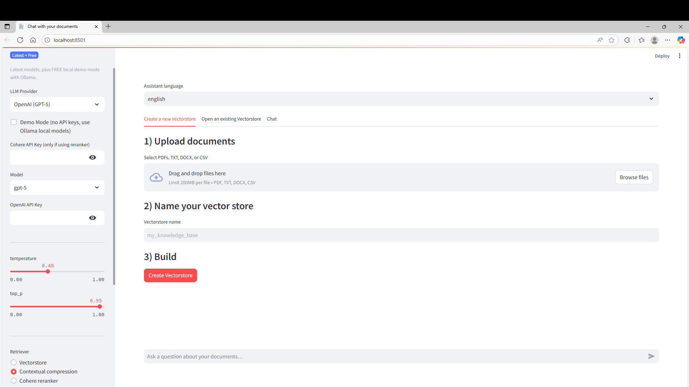

# RAG Chatbot — Chat with Your Documents

A **Retrieval-Augmented Generation (RAG)** app built with **Streamlit** and **LangChain**.  
Upload your documents, index them locally, and chat with **context-aware, multilingual answers and transparent citations**.

---

## Features
- **Latest multi-provider LLM support**:
  - **OpenAI GPT-5 family** (`gpt-5`, `gpt-5-mini`, `gpt-5-nano`, `gpt-4o`)
  - **Google Gemini 2.5 family** (`gemini-2.5-pro`, `flash`, `flash-lite`)
  - **Hugging Face Serverless** (e.g. *Llama-3.1*, *Mistral-7B*, *DeepSeek-R1*)
  - **Ollama (Local, FREE)** — runs completely offline with `llama3` + `nomic-embed-text`
- **Automatic Demo Mode** — works even without API keys by switching to Ollama or local embeddings.
- **Document types supported**: PDF, TXT, CSV, DOCX
- **Persistent vector DB**: Chroma (stored under `data/vector_stores`)
- **Retrieval strategies**:
  - Vectorstore retriever (default)
  - Contextual Compression (split → deduplicate → semantic filter → reorder)
  - Cohere Reranker (optional, for high-precision reranking)
  - Hybrid search *(BM25 + dense embeddings)* for better recall
- **Conversational memory** (buffer or summary)
- **Multilingual answers** — supports English, Japanese, French, Spanish, German, Chinese, Arabic, etc.
- **Transparent citations** for every response
- **Local/Cloud flexibility** — switch providers and models instantly from the sidebar.

---

## Quickstart

### 1) Clone & Setup
```bash
git clone https://github.com/your-username/rag-chatbot.git
cd rag-chatbot
python3 -m venv .venv
source .venv/bin/activate
pip install --upgrade pip
pip install -r requirements.txt
```

### 2) Prepare folders
```bash
mkdir -p data/tmp data/vector_stores
```

### 3) Run the app
```bash
streamlit run rag_app.py
```

## How it works
1. Upload documents — supported formats: PDF, TXT, CSV, DOCX
2. Chunking — each document is split into overlapping sections for retrieval
3. Embeddings — text chunks are embedded using:
  - OpenAI / Google / Hugging Face APIs, or
  - Local embeddings via Ollama or sentence-transformers
4. Vector storage — embeddings are saved in a persistent Chroma database
5. Retriever selection — choose between vector, contextual compression, reranker, or hybrid retrieval
6. Conversation — chat naturally; the assistant retrieves relevant context and maintains memory
7. Answer generation — responses are generated using your chosen model family with proper citations

## Requirements
- Python 3.12+
- Streamlit, LangChain, Chroma
- Optional API keys:
  - OpenAI (for GPT-5 / GPT-4o)
  - Google (for Gemini 2.5)
  - Hugging Face (for serverless models)
  - Cohere (only for reranking)
- No API keys required if using Demo Mode or Ollama (local setup)

## Interface Preview
```bash

```